# FriendFinder

### The Assignment
To build a compatibility-based "FriendFinder" application -- basically a dating app. This full-stack site will take in results from your users' surveys, then compare their answers with those from other users. The app will then display the name and picture of the user with the best overall match.

### How it works
This app requires two npm packages, "express" and "path." Using express, api routes are created on the local machine by using "GET" and "POST" requests. The html routes are used to display each specified .html file. Server.js was used to connect all the files together and display them on the specified PORT on the local machine. Additionally, an algorithm was used to determine the best friend match based on the user's input.

### Demo

FriendFinder:
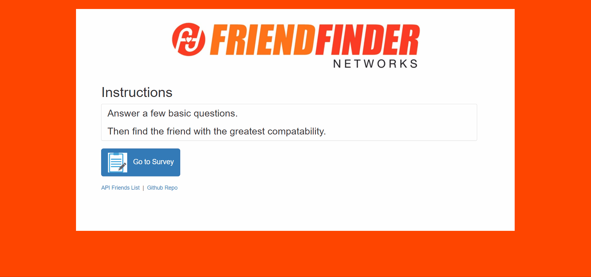 

### Screenshots

server.js:
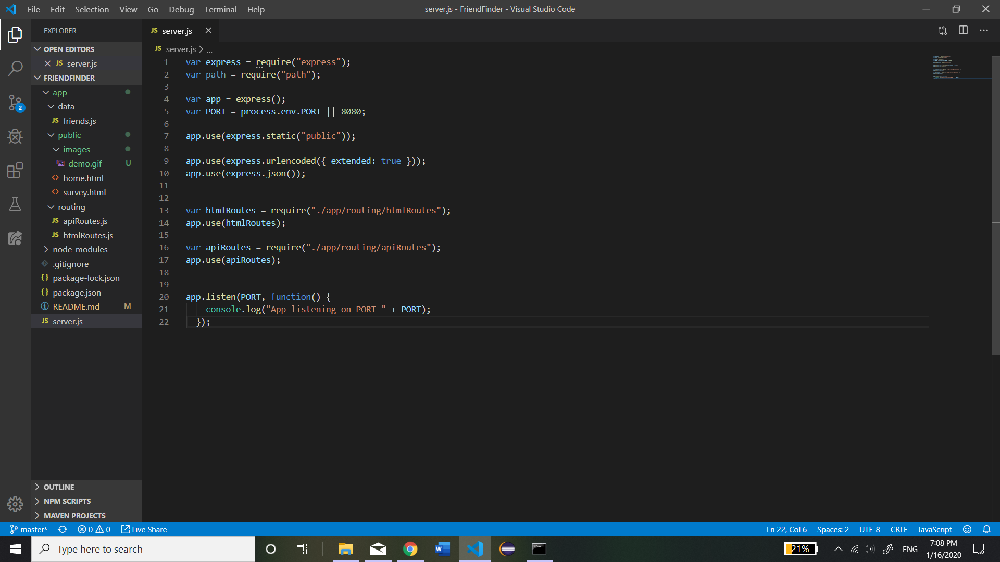

friends.js:
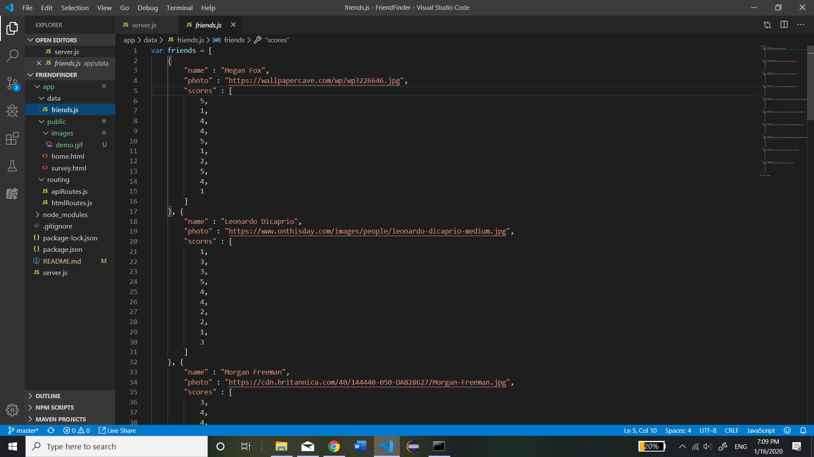

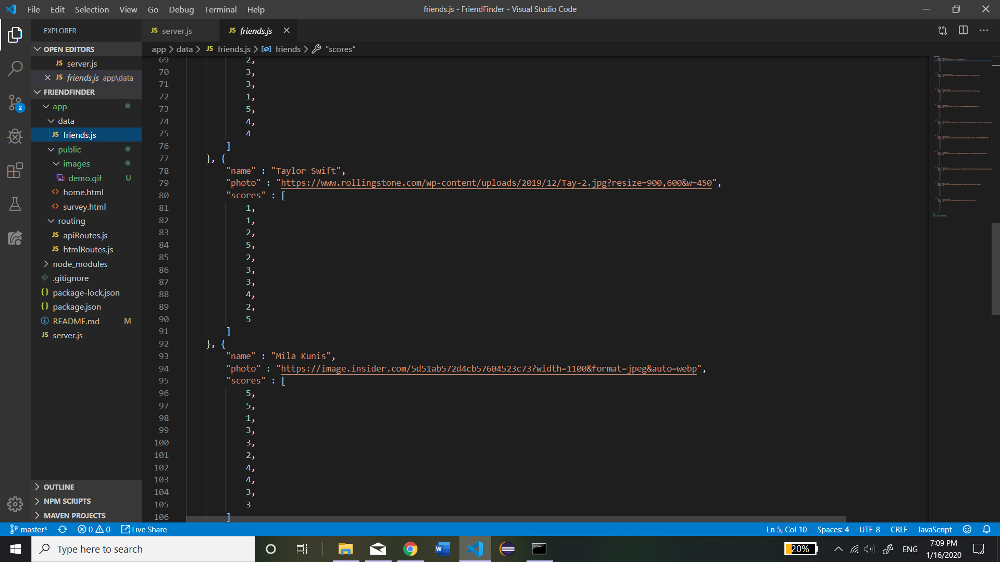
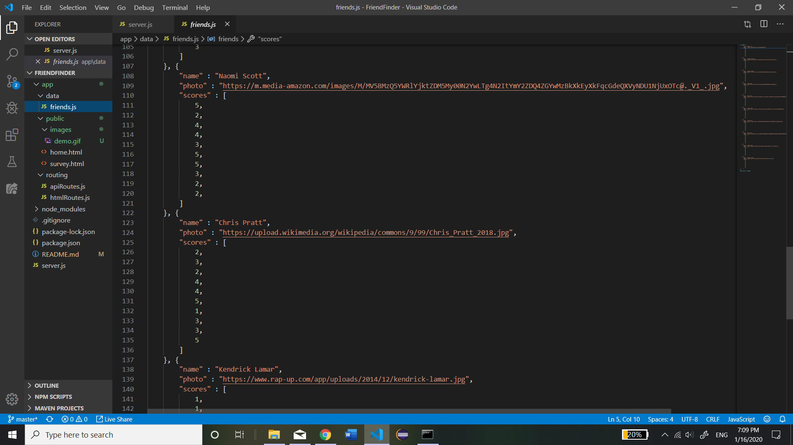
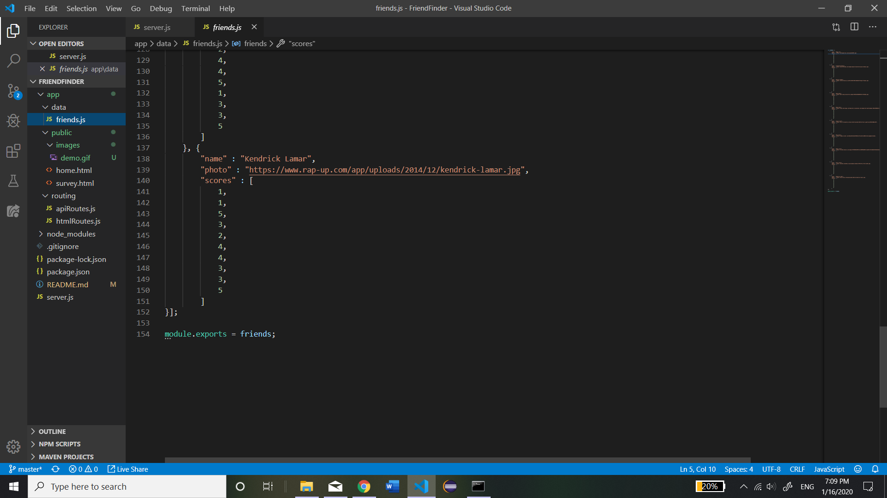

apiRoutes.js:
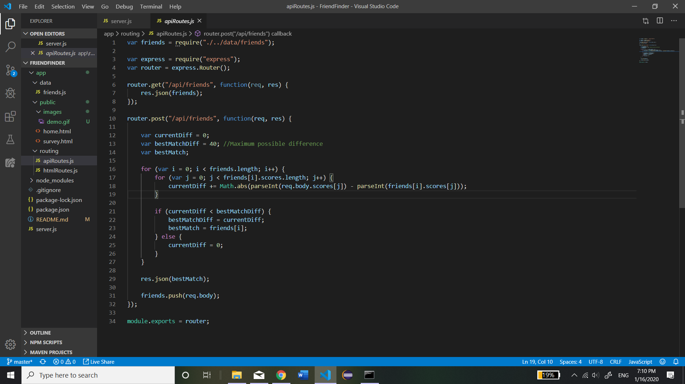

htmlRoutes.js:
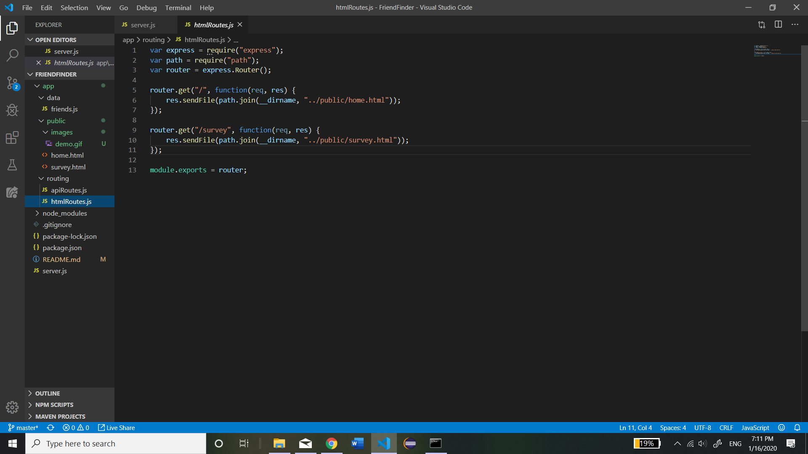

home.html:
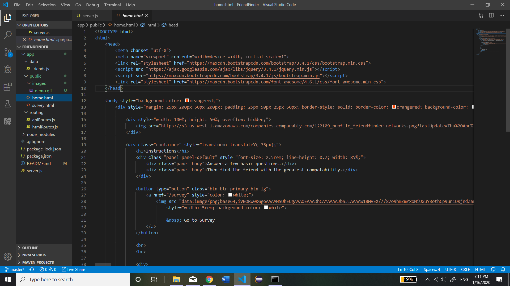
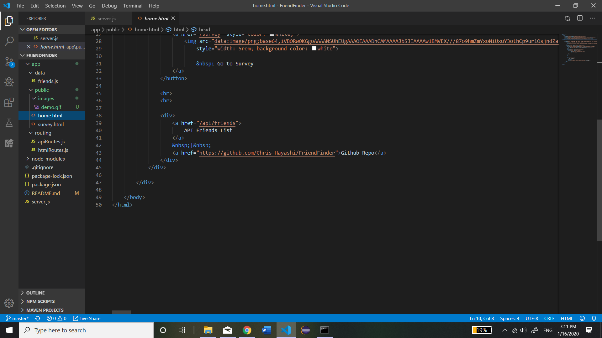

survey.html:
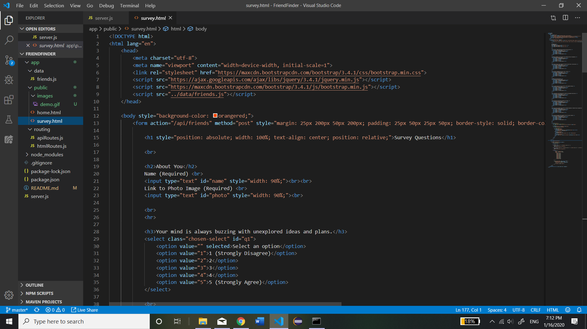
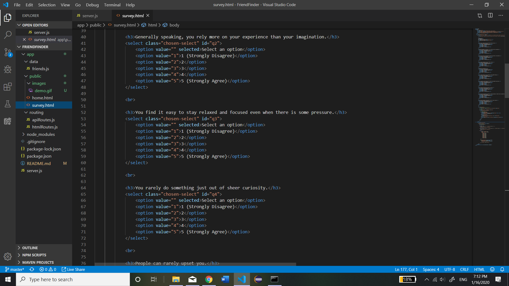
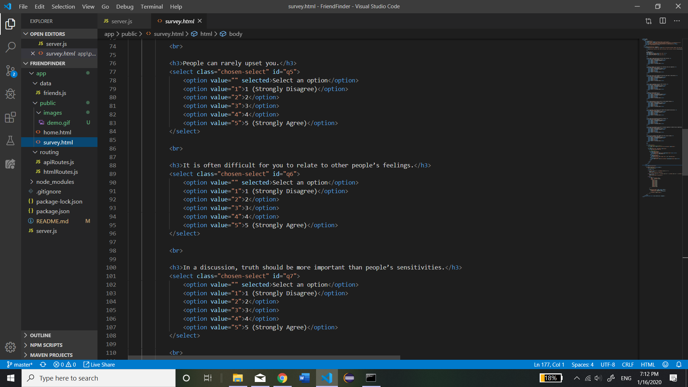
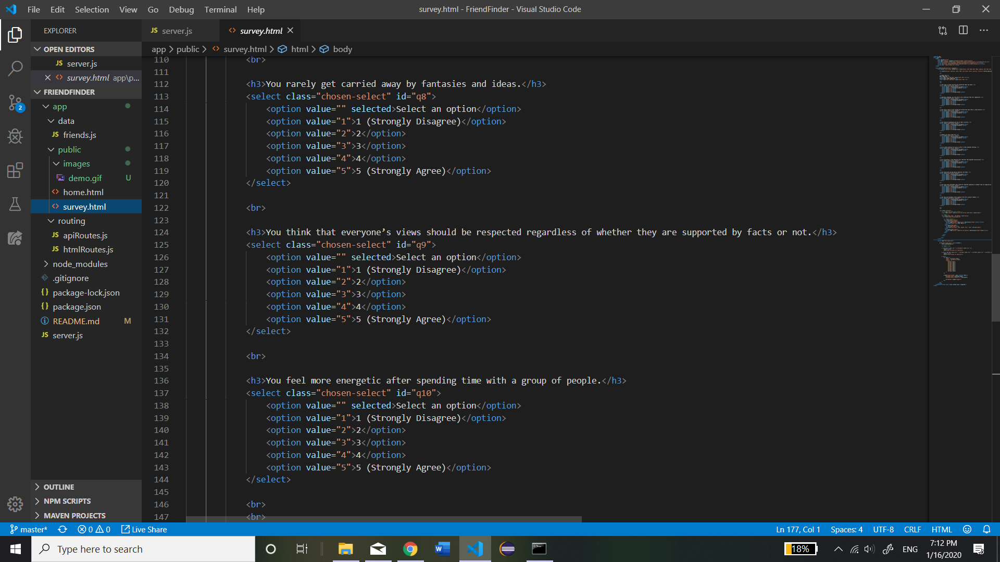
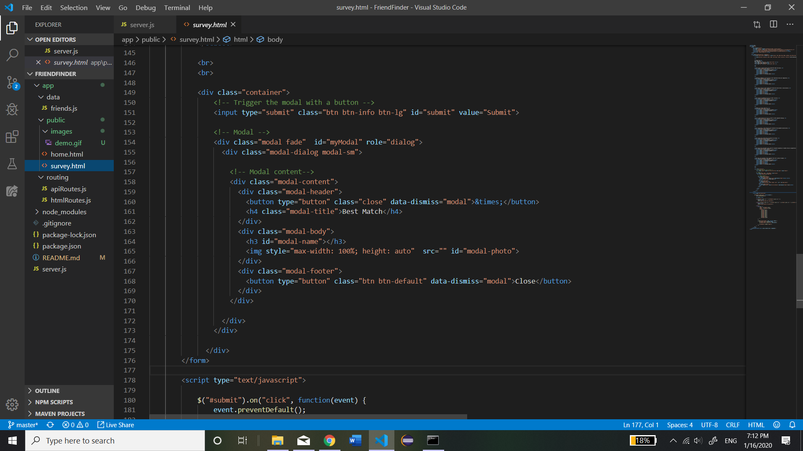
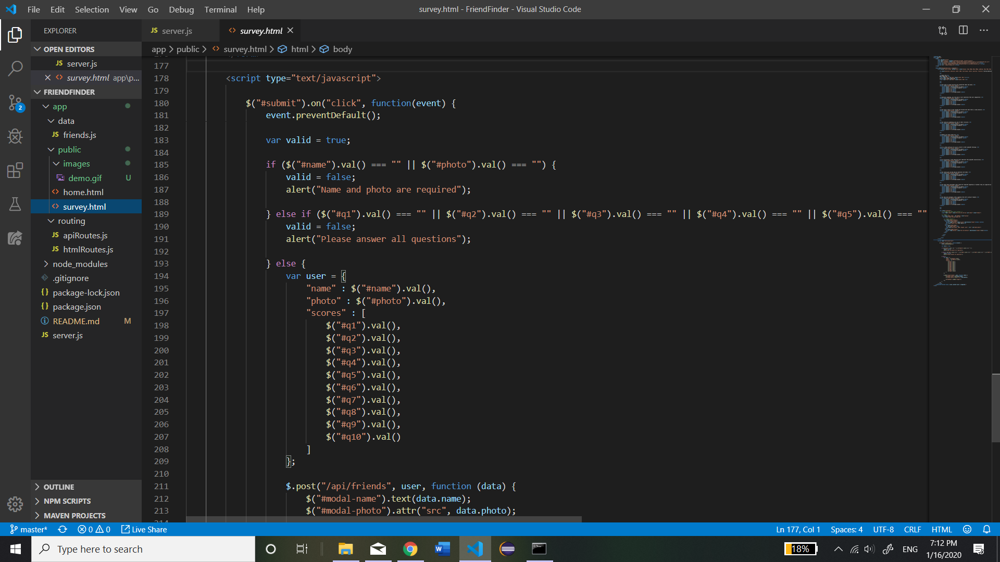
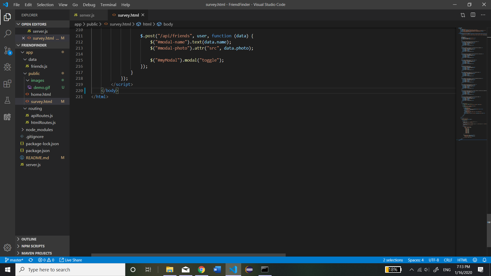